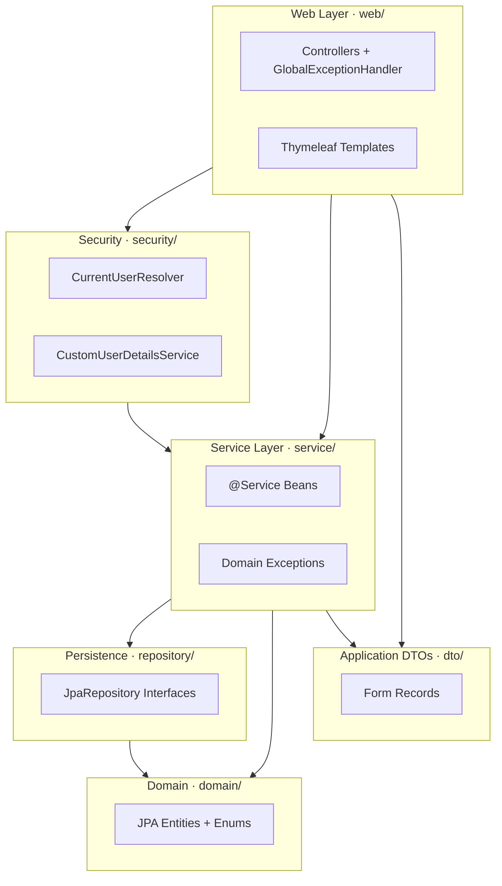
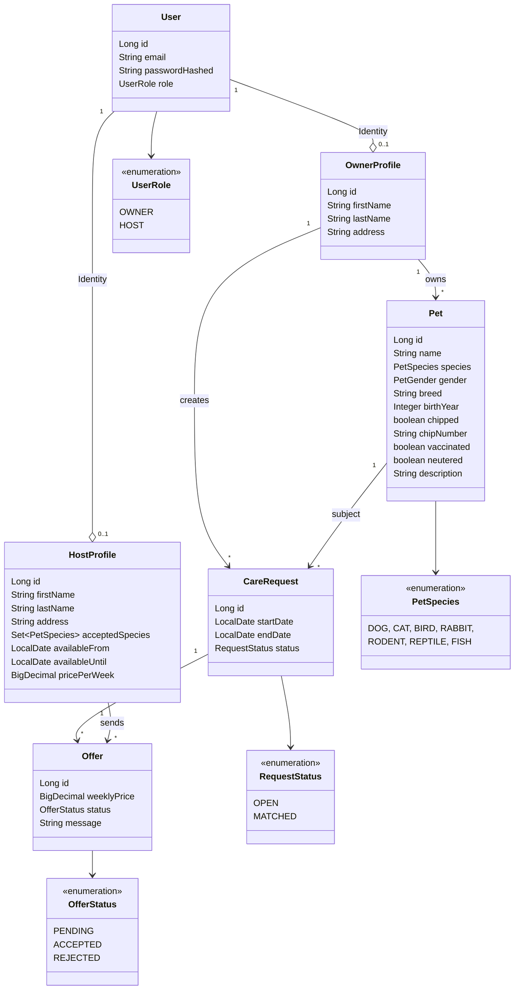

# Architektur-Dokumentation

> **Pawsitters — Pet Holiday Platform.** Vermittlungs-Plattform: Tierhalter publizieren Betreuungsanfragen für ihren Urlaub, Hosts geben Angebote ab, Owner akzeptieren genau eines davon, andere werden automatisch abgelehnt.

## 1. Stakeholder & funktionale Anforderungen

| Stakeholder | Bedürfnis |
|---|---|
| **Owner** (Tierhalter) | Pet anlegen, Betreuungsanfrage stellen, eingehende Angebote prüfen, eines annehmen |
| **Host** (Betreuer) | Profil mit akzeptierten Tierarten + Verfügbarkeit anlegen, passende Anfragen sehen, Angebote senden |
| **Dozentin (Reviewer)** | Nachvollziehbare Architektur + Doku, ausführbarer Live-Demo, lesbarer Code |

**Funktionale Kernfunktionen** (alle umgesetzt):
- Owner- und Host-Profile mit getrennten Rollen
- Pet-Registrierung
- CareRequest mit Datums-Range
- Angebot-Versand durch Hosts + Anzeige passender Hosts
- Owner akzeptiert ein Angebot → andere PENDING-Offers werden kaskadiert auf REJECTED gesetzt
- Manuelle Ablehnung einzelner Offers
- Status-Updates (`OPEN` → `MATCHED` auf CareRequest, `PENDING` → `ACCEPTED` / `REJECTED` auf Offer)

## 2. Nicht-funktionale Anforderungen

| Bereich | Wie umgesetzt |
|---|---|
| **Sicherheit** | Spring Security mit Form-Login, BCrypt-Hashes, CSRF-Schutz, Role-based Access (`OWNER` / `HOST`) |
| **Validierung** | Jakarta Bean Validation auf Forms UND Entities (Defense-in-Depth) |
| **Persistenz-Integrität** | Hibernate `ddl-auto: validate` in Prod → Schema-Drift bricht den Start |
| **Testbarkeit** | 155 Tests, 95 % Line-Coverage (JaCoCo-Gate erzwingt ≥ 80 %) |
| **Architektur-Konformität** | ArchUnit-Tests erzwingen Schicht-Regeln in CI |
| **Deployment-Reife** | Multi-Stage-Dockerfile, Railway-Auto-Deploy, Actuator-Health- und Info-Endpoints |

## 3. Architektur-Stil: klassische MVC + Layered Architecture

Wir haben uns gegen Microservices entschieden — bewusst. **Begründung:**

- **Drei Studenten, ein begrenzter Zeitrahmen.** Microservices bringen Inter-Service-Kommunikation, verteilte Transaktionen, eigene Deployment-Pipelines pro Service — alles Overhead, der für den fachlichen Scope hier keinen Mehrwert liefert.
- **Die Domäne hat einen klaren, einzelnen Bounded-Context** (Vermittlung Owner ↔️ Host). Es gibt keinen Subdomain-Konflikt, der einen Service-Schnitt natürlich macht.
- **MVC + Layered** ist in der Lehre der Standard, deshalb für jeden Reviewer sofort lesbar.

**Schichten-Übersicht:**

**Dependency-Richtung ist strikt unidirektional** und wird per ArchUnit erzwungen (siehe Abschnitt 7). Domain hat keine Outbound-Dependencies — sie ist der Kern, von dem alle anderen Schichten lesen.

## 4. Domain-Modell

**Design-Entscheidungen im Modell:**

- **`User` getrennt von `OwnerProfile` / `HostProfile`.** Authentifizierung (Email + Password-Hash + Rolle) ist von Profildaten (Adresse, Verfügbarkeit, …) konzeptionell getrennt. Pro `User` existiert genau **eines** der zwei Profile, gesteuert durch `UserRole`.
- **Status als Enum, nicht als String.** Kompilier-erzwungene Vollständigkeit von State-Machine-Checks.
- **`acceptedSpecies` als `Set<PetSpecies>` mit eigener Join-Tabelle** (`host_accepted_species`, Composite-PK), nicht als CSV-String — sauber normalisiert und queryfähig.
- **`@NoArgsConstructor(access = AccessLevel.PROTECTED)`** auf allen Entities: JPA braucht den Default-Konstruktor, aber Application-Code darf keine ungültigen Entities bauen.

## 5. Schichten im Detail

### Domain (`domain/`)
- Reine JPA-Entities + Enums
- **Keinerlei Spring-Imports.** Nur `jakarta.persistence`, `jakarta.validation`, `lombok`. Damit ist die Domain framework-portabel.
- Cross-Field-Validation per `@AssertTrue` direkt am Entity (z. B. `isDateRangeValid` auf `CareRequest`).

### Repository (`repository/`)
- Sechs JPA-Repository-Interfaces, eines pro Aggregat (`UserRepository`, `OwnerProfileRepository`, `HostProfileRepository`, `PetRepository`, `CareRequestRepository`, `OfferRepository`).
- Custom-Queries als `@Query` (JPQL) in `CareRequestRepository.findMatchingForHost(...)` — gleicht Tierart + Datums-Range + Status gegen einen Host ab.
- Test-Stil: `@DataJpaTest` gegen In-Memory-H2.

### Service (`service/`)
- Fünf Business-Services. **Owner-Scoping** als zentrales Security-Pattern: bevor eine Operation an einem Aggregat ausgeführt wird, prüft der Service, ob das Aggregat zum eingeloggten User gehört — sonst wird die gleiche `NotFoundException` geworfen wie bei Nichtexistenz (kein Info-Leak via URL-Manipulation).
- Service-to-Service-Composition: `OfferService.createOffer` re-verifiziert das Matching über `CareRequestRepository.findMatchingForHost` — keine zweite Wahrheits-Quelle.
- Eigene Exception-Hierarchie in `service.exception/` (`OfferNotFoundException`, `OfferNotPendingException`, `OfferNotEligibleException`, …) → Controller fängt sie nicht selbst, der `GlobalExceptionHandler` mappt sie auf HTTP-Codes.

### DTOs (`dto/`)
- Form-Records mit Bean-Validation-Annotations.
- **Top-Level-Paket statt `web.form/`** — Resultat eines durch ArchUnit aufgedeckten Zyklus: Services nehmen Forms als Parameter; lägen die im `web/`-Paket, hätte `service` auf `web` gezeigt → Schichtenverstoß. Form-DTOs sind Application-Layer-Commands, nicht web-spezifisch.

### Web (`web/controller/`)
- Sechs Controller (Auth, Owner, Host, Pet, CareRequest, Offer) + `GlobalExceptionHandler` als `@ControllerAdvice`.
- Server-side-Rendering mit Thymeleaf. Keine REST-API — bewusste Wahl, der Anwendungsfall ist eine geschlossene Web-App, kein Headless-Backend für mehrere Clients.
- Authentifizierung über `CurrentUserResolver` (in `security/`) — eliminiert die DRY-Verletzung, die wir vor Refactor hatten (User-ID-Auflösung in jedem Controller dupliziert).

### Security (`security/`)
- `CustomUserDetailsService` als Spring-Security-Adapter über die JPA-Persistierung.
- `CurrentUserResolver` als zentraler Helper für `UserDetails → User-ID`.
- Spring Security mit Form-Login, BCrypt, CSRF-aktiv, Session-Cookie.

### Config (`config/`)
- `SecurityConfig` — Filter-Chain, Path-Whitelist, Public vs. Role-protected Routes.
- `DevUsersConfig` — seedet Demo-Daten beim Start (nur im `dev`-Profil).

## 6. Tech-Stack & Begründungen

| Schicht | Wahl | Warum |
|---|---|---|
| Sprache | Java 21 | Vorgegeben + LTS, Records für DTOs |
| Framework | Spring Boot 4.0.6 | Auto-Config spart Boilerplate, Spring Security/Data/MVC aus einem Guss |
| Web | Spring MVC + Thymeleaf | Server-side-Rendering passt zum geschlossenen Anwendungsfall, kein React-Overhead |
| Persistenz | Spring Data JPA + Hibernate | Repository-Pattern direkt aus dem Interface, JPQL für Custom-Queries |
| DB Dev/Test | H2 in-memory | Schneller Start, keine externe Abhängigkeit für Tests |
| DB Prod | PostgreSQL 16 + Flyway | Persistent, Production-Standard, Schema-Migrations versioniert im Repo |
| Build | Maven (Wrapper) | Vorgegeben; Wrapper macht Build auf jeder Maschine reproduzierbar |
| Tests | JUnit 5 + Mockito + Spring Test | Vorgegeben + Standard-Stack |
| Coverage | JaCoCo mit Build-Gate | LINE ≥ 80 %, BRANCH ≥ 65 % — Schwelle reißt bei Regression |
| Architektur-Tests | ArchUnit | Layered-Boundaries und Naming-Konventionen als CI-erzwungene Regeln |
| Security-Scan | OWASP Dependency-Check | CVEs in Dependencies bei Build-Gate ≥ 7.0 (CVSS) |
| Deployment | Multi-stage Docker → Railway | ~250 MB Final-Image, Non-root User, Auto-Deploy auf `main`-Push |

## 7. Architektur als Code — ArchUnit

Klassische Architektur-Diagramme rotten in den Sprints: Code-Reviewer ignorieren ein PDF, das in Confluence liegt. Wir erzwingen die Architektur deshalb in **9 ArchUnit-Regeln**, die bei jedem CI-Build laufen:

- **Schicht-Regeln**: Web greift nie direkt auf `repository`, Domain hat keine Outbound-Dependencies, Repositories kennen kein Service/Web, Domain importiert kein Spring.
- **Naming**: `@Controller`-Klassen leben in `web.controller/` und enden auf `Controller`, Services in `service/` enden auf `Service`, Repositories auf `Repository`.
- **Zyklenfreiheit** zwischen Top-Level-Paketen — diese Regel hat den `dto`-Refactor getriggert (siehe Abschnitt 5).

Eine Architekturentscheidung, die in Code erzwungen wird, kann nicht durch Vergesslichkeit verletzt werden. Das ist der Kern von **„Architecture as Code"**.

## 8. Persistenz-Strategie

Drei Profile in `application.yaml`:

| Profil | Datasource | Schema-Verwaltung | Genutzt von |
|---|---|---|---|
| `dev` (Default) | H2 in-memory | `ddl-auto: create-drop` + Dev-Seed | Lokale Entwicklung, `./mvnw spring-boot:run` |
| `test` | H2 in-memory (isoliert) | `ddl-auto: create-drop`, kein Seed | `./mvnw test` |
| `prod` | PostgreSQL 16 | **Flyway-Migrationen** (`V1__init_schema.sql`, `V2__add_message_to_offers.sql`), Hibernate auf `validate` | Railway-Deployment |

Wechsel zwischen Profilen geschieht ausschließlich über `SPRING_PROFILES_ACTIVE` — kein Code-Eingriff nötig. Prod-DB-Verbindung über Standard-PG-Environment-Variables.

## 9. Schnittstellen

Wir exponieren **keine REST-API**. Die Anwendung ist ein abgeschlossener Server-Rendered-Web-Client; alle Interaktionen laufen über Form-POSTs mit CSRF-Token.

Ausnahme — Operations-Endpoints über Spring Boot Actuator:
- `GET /actuator/health` — öffentlich, für Railway-Healthcheck-Probe
- `GET /actuator/info` — öffentlich, zeigt Git-Hash / Build-Time
- Alle anderen Actuator-Endpoints sind in `application.yaml` explizit nicht exposed (Defense-in-Depth).

## 10. Trade-offs & Limitierungen

| Entscheidung | Was wir gewinnen | Was wir aufgeben |
|---|---|---|
| Monolith statt Microservices | Einfacheres Deployment, eine Build-Pipeline, keine Inter-Service-Komplexität | Skalierung pro Domäne, Polyglot-Persistence-Optionen |
| Server-Rendered statt SPA | Kein Build-Tool-Stack im Frontend, kein State-Management-Overhead | Reichere Client-Interaktivität, mobile-App-Reuse |
| Form-Records direkt im Service | Kein Mapper-Boilerplate für ein Schulprojekt | Mapper-Layer wie ihn größere Codebases haben (DTO ↔️ Entity Trennung) |
| ArchUnit-Schwelle bewusst nicht zu strikt | Pragmatische Regel-Akzeptanz | Manche feinkörnigen Verletzungen werden nicht gefangen |

## 11. Was in einer Produktiv-Version dazukommen müsste

- Pagination auf Listen-Views (#79)
- HTMX für partial page updates (#75)
- i18n via Spring MessageSource (#77)
- Domain Events bei `OfferService.accept` (#76)
- Dependabot für automatische Dependency-Updates (#78)
- Erweiterte Integrationstests (#42)