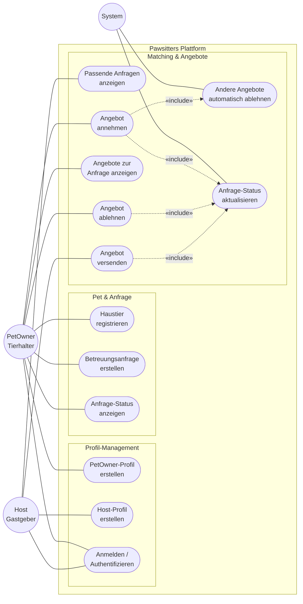

# Use-Case-Diagramm

Dieses Diagramm zeigt die Akteure des Pawsitters-Systems und ihre Interaktionen mit den fachlichen Use Cases.

## Akteure

- **PetOwner (Tierhalter)** – sucht Betreuung für sein Haustier während der Abwesenheit.
- **Host (Gastgeber)** – bietet Betreuung gegen Bezahlung an.
- **System** – führt automatische Aktionen aus (Status-Updates, automatische Ablehnung konkurrierender Angebote).

## Diagramm

## Use-Case-Beschreibungen

| ID | Use Case | Primärer Akteur | Beschreibung |
|----|----------|-----------------|--------------|
| UC1 | PetOwner-Profil erstellen | PetOwner | Tierhalter legt sein Profil mit Stammdaten an. |
| UC2 | Host-Profil erstellen | Host | Gastgeber legt sein Profil an (akzeptierte Tierarten, Verfügbarkeit, Preis pro Woche). |
| UC3 | Anmelden / Authentifizieren | PetOwner, Host | Nutzer meldet sich am System an. |
| UC4 | Haustier registrieren | PetOwner | Tierhalter legt sein Haustier mit Tierart und Details an. |
| UC5 | Betreuungsanfrage erstellen | PetOwner | Tierhalter erstellt eine Anfrage für einen Zeitraum. |
| UC6 | Anfrage-Status anzeigen | PetOwner | Tierhalter sieht den aktuellen Status seiner Anfragen. |
| UC7 | Passende Anfragen anzeigen | Host | Host sieht Anfragen, die zu seinem Profil (Tierart, Verfügbarkeit) passen. |
| UC8 | Angebot versenden | Host | Host sendet ein Angebot zu einer Anfrage. |
| UC9 | Angebote zur Anfrage anzeigen | PetOwner | Tierhalter sieht alle eingegangenen Angebote. |
| UC10 | Angebot annehmen | PetOwner | Tierhalter akzeptiert genau ein Angebot. |
| UC11 | Angebot ablehnen | PetOwner | Tierhalter lehnt ein Angebot aktiv ab. |
| UC12 | Andere Angebote automatisch ablehnen | System | Beim Annehmen eines Angebots werden alle anderen Angebote zur selben Anfrage automatisch abgelehnt. |
| UC13 | Anfrage-Status aktualisieren | System | Status der Anfrage wird abhängig von Aktionen (Annahme, Ablehnung, Versand) aktualisiert. |

## «include»-Beziehungen

- **UC10 (Annehmen)** schließt **UC12 (Auto-Ablehnung)** und **UC13 (Status-Update)** ein.
- **UC11 (Ablehnen)** schließt **UC13 (Status-Update)** ein.
- **UC8 (Versenden)** schließt **UC13 (Status-Update)** ein.

## Bezug zu Issues

Dieses Diagramm referenziert folgende Issues (Mindestanforderungen aus der Projektbeschreibung):

- UC1 → #2 (geschlossen)
- UC2 → #3
- UC3 → #15, #29
- UC4 → #4 (geschlossen), #24
- UC5 → #5 (geschlossen), #25
- UC6 → #10, #28
- UC7 → #6, #26
- UC8 → #7, #26
- UC9 → #6, #27
- UC10 → #8, #27
- UC11 → #27
- UC12 → #9
- UC13 → #10
